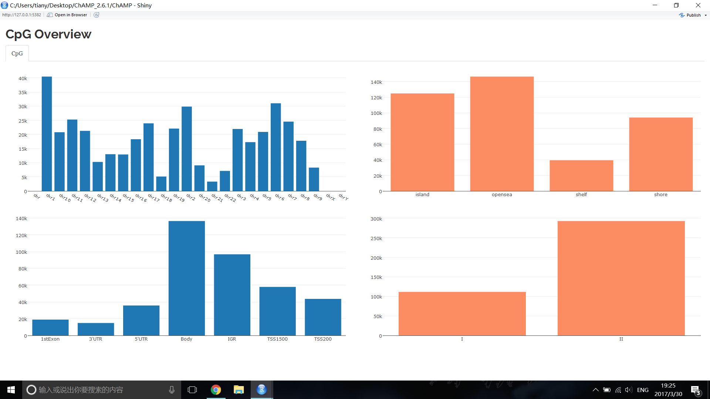
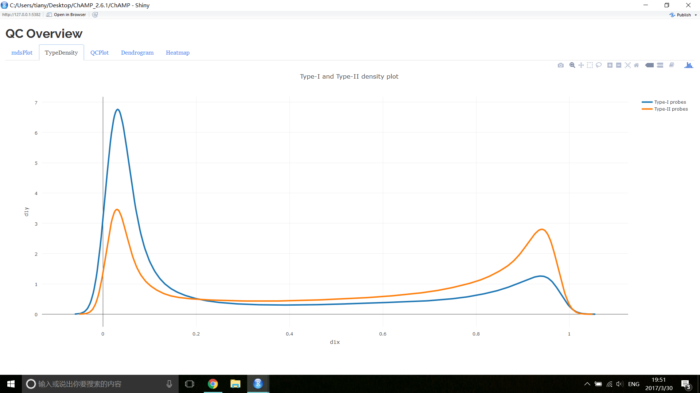
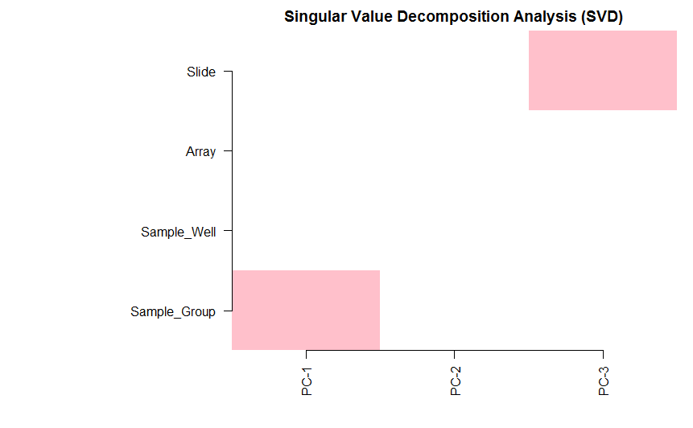
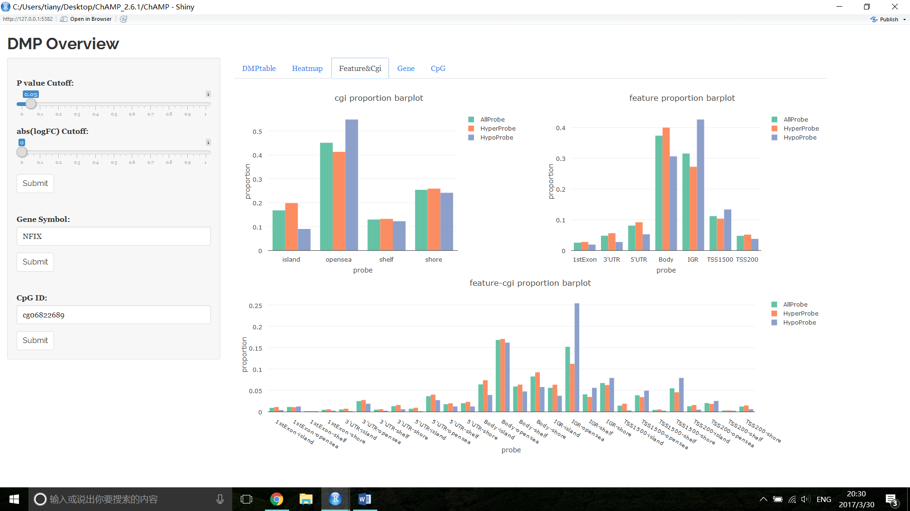
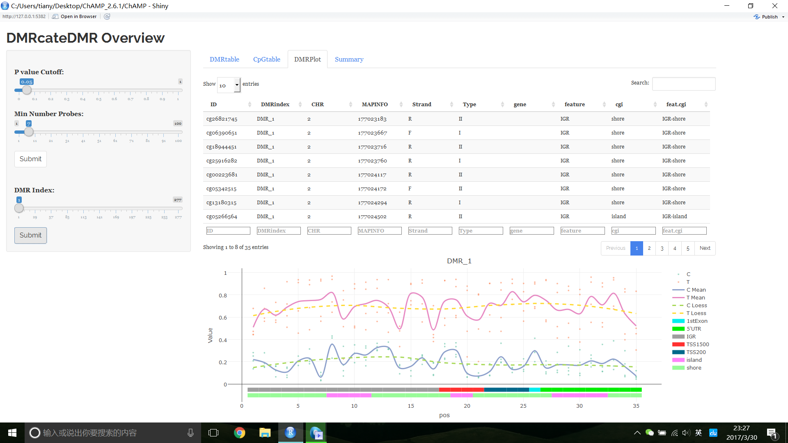
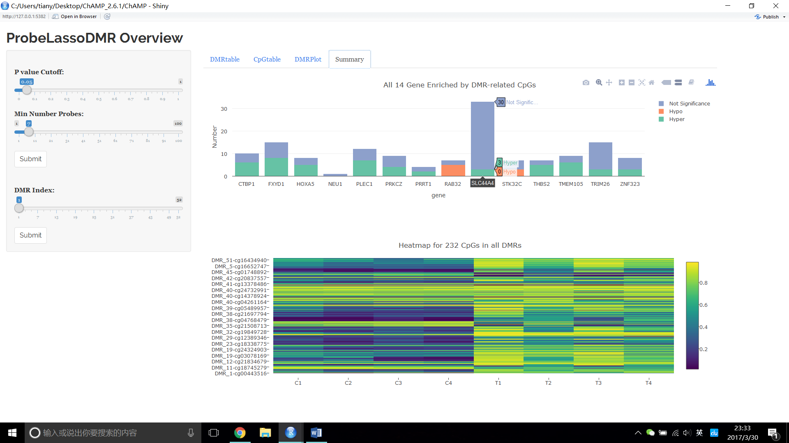
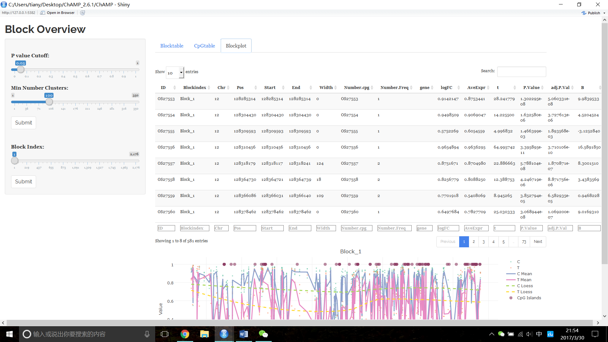
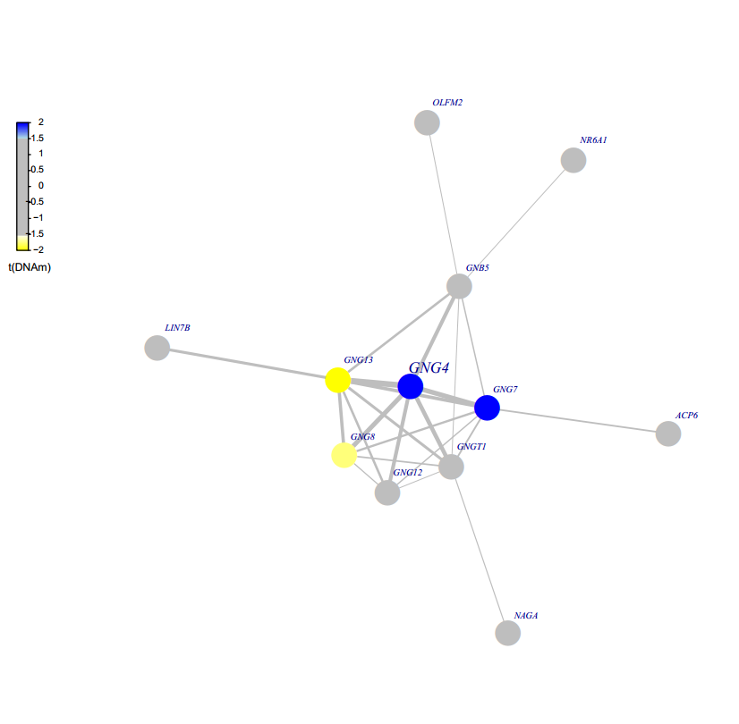
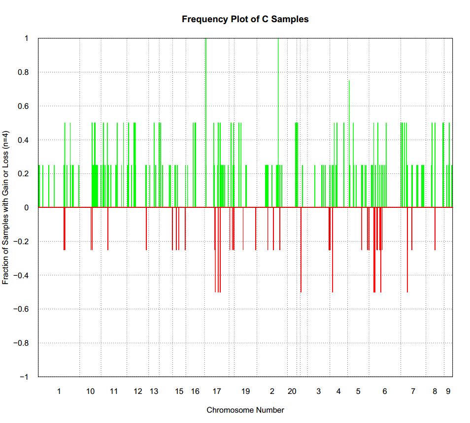

# Demo450K DataSet

This 450K data set contains 8 samples, 4 cancer and 4 normal, which is perfect for testing 450K dataset with ChAMP.

## Code：

``` r
# Set data path for loading, this dataset was contained in ChAMPdata.
testDir=system.file("extdata",package="ChAMPdata")
# Load Data
myLoad <- champ.load(testDir,arraytype="450K")
# Check Distribution of CpGs on chromosome, Island Regions and so on.
CpG.GUI()
# Normlize with BMIQ method.
myNorm <- champ.norm(myLoad$beta) # Tried 4 methods below
# Normlize with PBC method.
myNorm_2 <- champ.norm(myLoad$beta,method="PBC")
# Normlize with SWAN method.
myNorm_3 <- champ.norm(myLoad$beta,method="SWAN")
# Normlize with FunctionNormalization method.
myNorm_4 <- champ.norm(myLoad$beta,method="FunctionNormalization")
# Check Quality Control of this data set
QC.GUI()
# Do SVD check on data set
champ.SVD()
# Correct batch effect on "Slide" factor.
myCombat <- champ.runCombat(myNorm,pd = myLoad$pd,batchname="Slide")
# Detect DMP
myDMP <- champ.DMP()
# Check DMP result
DMP.GUI()
# Calculate DMR with Bumphunter Method
myDMR <- champ.DMR()
# Calculate DMR with DMRcate Method
myDMR_2 <- champ.DMR(method="DMRcate",cores=1)
# Calculate DMR with ProbeLasso Method
myDMR_3 <- champ.DMR(method="ProbeLasso",minProbes = 3)
# Check DMR result
DMR.GUI()
# Calculate GSEA result with goseq method.
champ.GSEA()
# Calculate Differential Methylation Block with champ.GSEA()
myBlock <- champ.Block()
# Check DMB result.
Block.GUI()
# Calculate EpiMod with FEM package.
champ.EpiMod()
# Do reference base cell correction.
myrefbase <- champ.refbase()
# Do ReffreeEWAS on data set.
myreffree <- champ.reffree()
# Calculate Copy Number Variance.
myCNA <- champ.CNA()
```

---

### champ.load() result
``` r
> myLoad <- champ.load(testDir,arraytype="450K")
[===========================]
[<<<< ChAMP.LOAD START >>>>>]
-----------------------------
Loading data from C:/Users/tiany/Documents/R/win-library/3.3/ChAMPdata/extdata
[read.metharray.sheet] Found the following CSV files:

[1] "C:/Users/tiany/Documents/R/win-library/3.3/ChAMPdata/extdata/lung_test_set.csv"
Loading required package: IlluminaHumanMethylation450kmanifest
<< Read DataSet Success. >>

The fraction of failed positions per sample
 
            (You may need to delete samples with high proportion of failed probes
): 
   Failed CpG Fraction.
C1         0.0013429122
C2         0.0022162171
C3         0.0003563249
C4         0.0002842360
T1         0.0003831007
T2         0.0011946152
T3         0.0014953286
T4         0.0015447610
Filtering probes with a detection p-value above 0.01 in one or more samples has removed 2728 probes from the analysis. If a large number of probes have been removed, ChAMP suggests you to identify potentially bad samples.
<< Filter DetP Done. >>

Filtering probes with a beadcount <3 in at least 5% of samples, has removed 9291 from the analysis.
<< Filter Beads Done. >>

Filtering non-cg probes, has removed 2959 from the analysis.
<< Filter NoCG Done. >>

Using general 450K SNP list for filtering.
Filtering probes with SNPs as identified in Zhou's Nucleic Acids Research Paper, 2016, has removed 49231 from the analysis.
<< Filter SNP Done. >>

Filtering probes that align to multiple locations as identified in Nordlund et al, has removed 7003 from the analysis.
<< Filter MultiHit Done. >>

Filtering probes on the X or Y chromosome has removed 9917 from the analysis.
<< Filter XY chromosome Done. >>

[Beta value is selected as output.]

Zeros in your dataset have been replaced with smallest positive value.

One in your dataset have been replaced with largest value below 1.

The analysis will be proceed with 404383 probes and 8 samples.

[<<<<< ChAMP.LOAD END >>>>>>]
[===========================]
[You may want to process champ.QC() next.]

There were 50 or more warnings (use warnings() to see the first 50)
> 
```

### CpG.GUI() Result



### champ.norm() Result
``` r
> myNorm <- champ.norm(myLoad$beta)
[===========================]
[>>>>> ChAMP.NORM START <<<<<<]
-----------------------------
champ.norm Results will be saved in ./CHAMP_Normalization/
[ SWAN method call for BOTH rgSet and mset input, FunctionNormalization call for rgset only , while PBC and BMIQ only needs beta value. Please set parameter correctly. ]

<< Normalizing data with BMIQ Method >>
Note that,BMIQ function may fail for bad quality samples (Samples did not even show beta distribution).
3 cores will be used to do parallel BMIQ computing.
[>>>>> ChAMP.NORM END <<<<<<]
[===========================]
[You may want to process champ.SVD() next.]
> 
```

``` r
> myNorm_2 <- champ.norm(myLoad$beta,method="PBC")
[===========================]
[>>>>> ChAMP.NORM START <<<<<<]
-----------------------------
champ.norm Results will be saved in ./CHAMP_Normalization/
[ SWAN method call for BOTH rgSet and mset input, FunctionNormalization call for rgset only , while PBC and BMIQ only needs beta value. Please set parameter correctly. ]

<< Normalizing data with PBC Method >>
[1] "Done for sample 1"
[1] "Done for sample 2"
[1] "Done for sample 3"
[1] "Done for sample 4"
[1] "Done for sample 5"
[1] "Done for sample 6"
[1] "Done for sample 7"
[1] "Done for sample 8"
[>>>>> ChAMP.NORM END <<<<<<]
[===========================]
[You may want to process champ.SVD() next.]
```

``` r
> myNorm_3 <- champ.norm(myLoad$beta,method="SWAN")
[===========================]
[>>>>> ChAMP.NORM START <<<<<<]
-----------------------------
champ.norm Results will be saved in ./CHAMP_Normalization/
[ SWAN method call for BOTH rgSet and mset input, FunctionNormalization call for rgset only , while PBC and BMIQ only needs beta value. Please set parameter correctly. ]

[>>>>> ChAMP.NORM END <<<<<<]
[===========================]
[You may want to process champ.SVD() next.]
```

``` r
> myNorm_4 <- champ.norm(myLoad$beta,method="FunctionNormalization")
[===========================]
[>>>>> ChAMP.NORM START <<<<<<]
-----------------------------
champ.norm Results will be saved in ./CHAMP_Normalization/
[ SWAN method call for BOTH rgSet and mset input, FunctionNormalization call for rgset only , while PBC and BMIQ only needs beta value. Please set parameter correctly. ]

[preprocessFunnorm] Background and dye bias correction with noob
[preprocessNoob] Applying R/G ratio flip to fix dye bias...
[preprocessFunnorm] Mapping to genome
[preprocessFunnorm] Quantile extraction
[preprocessFunnorm] Normalization
[>>>>> ChAMP.NORM END <<<<<<]
[===========================]
[You may want to process champ.SVD() next.]
```


### QC.GUI() Result



### champ.SVD() Result


### champ.runCombat Result
``` r
> myCombat <- champ.runCombat(myNorm,pd = myLoad$pd,batchname="Slide")
[===========================]
[<< CHAMP.RUNCOMBAT START >>]
-----------------------------
<< Preparing files for ComBat >>
[Combat correction will be proceed with 404383 probes and 8 samples.]

<< Following Factors in your pd(sample_sheet.csv) could be applied to Combat: >>
<Slide>(factor):7990895118, 9247377086, 7766130112
[champ.runCombat have automatically select ALL factors contain at least two different values from your pd(sample_sheet.csv).]

<< Following Factors in your pd(sample_sheet.csv) can not be corrected: >>
<Sample_Name>
<Sample_Plate>
<Sample_Group>
<Pool_ID>
<Project>
<Sample_Well>
<Array>
<Basename>
<filenames>
[Factors are ignored because they only indicate Name or Project, or they contain ONLY ONE value across all Samples, or some phenotype contains less than 2 Samples.]
As your assigned in batchname parameter: Slide will be corrected by Combat function.

<< Start Correcting Slide >>
~Sample_Group
<environment: 0x00000000686dd408>
Generate mod success. Started to run ComBat, which is quite slow...
Found 3 batches
Adjusting for 1 covariate(s) or covariate level(s)
Standardizing Data across genes
Fitting L/S model and finding priors
Finding parametric adjustments
Adjusting the Data
champ.runCombat success. Corrected dataset will be returned.
> 
```


### champ.DMP() Result
``` r
> myDMP <- champ.DMP()
[===========================]
[<<<<< ChAMP.DMP START >>>>>]
-----------------------------
<< Your pheno information contains following groups. >>
<C>:4 samples.
<T>:4 samples.
[The power of statistics analysis on groups contain very few samples may not strong.]
You did not assign compare groups. The first two groups: <C> and <T>, will be compared automatically.

<< Contrast Matrix >>
      Contrasts
Levels pT-pC
    pC    -1
    pT     1

<< All beta, pheno and model are prepared successfully. >>
You have found 3832 significant MVPs with a BH adjusted P-value below 0.05.

<< Calculate DMP successfully. >>
[<<<<<< ChAMP.DMP END >>>>>>]
[===========================]
[You may want to process DMP.GUI() or champ.GSEA() next.]

```

### DMP.GUI() Result



### champ.DMR() Result
``` r
> myDMR <- champ.DMR()
[===========================]
[<<<<< ChAMP.DMR START >>>>>]
-----------------------------
<< Find DMR with Bumphunter Method >>
3 cores will be used to do parallel BMIQ computing.
According to your data set, champ.DMR() detected 7372 clusters contains MORE THAN 7 probes within300 maxGap. These clusters will be used to find DMR.

[bumphunterEngine] Parallelizing using 3 workers/cores (backend: doParallelSNOW, version: 1.0.10).
[bumphunterEngine] Computing coefficients.
[bumphunterEngine] Smoothing coefficients.
[bumphunterEngine] Performing 250 bootstraps.
[bumphunterEngine] Computing marginal bootstrap p-values.
[bumphunterEngine] Smoothing bootstrap coefficients.
[bumphunterEngine] cutoff: 1.691
[bumphunterEngine] Finding regions.
[bumphunterEngine] Found 917 bumps.
[bumphunterEngine] Computing regions for each bootstrap.
[bumphunterEngine] Estimating p-values and FWER.
<< Calculate DMR success. >>
Bumphunter detected 156 DMRs with P value <= 0.05.
[<<<<<< ChAMP.DMR END >>>>>>]
[===========================]
[You may want to process DMR.GUI() or champ.GSEA() next.]
```

``` r
> myDMR_2 <- champ.DMR(method="DMRcate",cores=1)
[===========================]
[<<<<< ChAMP.DMR START >>>>>]
-----------------------------
1 cores will be used to do parallel DMRcate computing.
<< Find DMR with DMRcate Method >>
Your contrast returned 5371 individually significant probes. We recommend the default setting of pcutoff in dmrcate().
Fitting chr1...
Fitting chr10...
Fitting chr11...
Fitting chr12...
Fitting chr13...
Fitting chr14...
Fitting chr15...
Fitting chr16...
Fitting chr17...
Fitting chr18...
Fitting chr19...
Fitting chr2...
Fitting chr20...
Fitting chr21...
Fitting chr22...
Fitting chr3...
Fitting chr4...
Fitting chr5...
Fitting chr6...
Fitting chr7...
Fitting chr8...
Fitting chr9...
Demarcating regions...
Done!
Bumphunter detected 277 DMRs with mafcut as= 0.05.
[<<<<<< ChAMP.DMR END >>>>>>]
[===========================]
[You may want to process DMR.GUI() or champ.GSEA() next.]
```


``` r
> myDMR_3 <- champ.DMR(method="ProbeLasso",minProbes = 3)
[===========================]
[<<<<< ChAMP.DMR START >>>>>]
-----------------------------
champ.DMR Results will be saved in ./CHAMP_ProbeLasso/
<< Find DMR with ProbeLasso Method >>
[===========================]
[<<<<< ChAMP.DMP START >>>>>]
-----------------------------
<< Your pheno information contains following groups. >>
<C>:4 samples.
<T>:4 samples.
[The power of statistics analysis on groups contain very few samples may not strong.]
You did not assign compare groups. The first two groups: <C> and <T>, will be compared automatically.

<< Contrast Matrix >>
      Contrasts
Levels pT-pC
    pC    -1
    pT     1

<< All beta, pheno and model are prepared successfully. >>
You have found 404383 significant MVPs with a BH adjusted P-value below 1.

<< Calculate DMP successfully. >>
[<<<<<< ChAMP.DMP END >>>>>>]
[===========================]
[You may want to process DMP.GUI() or champ.GSEA() next.]

<< Get closestProbe for each Probe >>
<< Get lassoQuantileThreshold for each featureCgi >>
<< Get expend ranges for each probe >>
<< Get DMR from overlapped probes >>
<< Get adjusted P value for DMR >>
<< Get Start-End Ranges for each DMR >>
<< Calculate Methylation Scores for each DMR >>
<< Generate Probe-level Data >>
<< Generate DMR metadata >>
ProbeLasso detected 52 DMRs with P value <= 0.05.
[<<<<<< ChAMP.DMR END >>>>>>]
[===========================]
[You may want to process DMR.GUI() or champ.GSEA() next.]

Warning message:
In dir.create(resultsDir) : '.\CHAMP_ProbeLasso' already exists
```


### DMR.GUI() Result





### champ.GSEA() Result
``` r
> myGSEA <- champ.GSEA()
[===========================]
[<<<< ChAMP.GSEA START >>>>>]
-----------------------------
<< Prepare Gene List Ready  >>
<< Start Do GSEA on each Gene List  >>
<< Do GSEA on Gene list DMP>>
goseq method will be used to do GSEA
This method is supported by goseq package, which is developed to address inequalivalent issue between number of CpGs and genes.
Fetching GO annotations...
For 4165 genes, we could not find any categories. These genes will be excluded.
To force their use, please run with use_genes_without_cat=TRUE (see documentation).
This was the default behavior for version 1.15.1 and earlier.
Calculating the p-values...
'select()' returned 1:1 mapping between keys and columns
<< Done for Gene list DMP >>
<< Do GSEA on Gene list DMR>>
goseq method will be used to do GSEA
This method is supported by goseq package, which is developed to address inequalivalent issue between number of CpGs and genes.
Fetching GO annotations...
For 4165 genes, we could not find any categories. These genes will be excluded.
To force their use, please run with use_genes_without_cat=TRUE (see documentation).
This was the default behavior for version 1.15.1 and earlier.
Calculating the p-values...
'select()' returned 1:1 mapping between keys and columns
<< Done for Gene list DMR >>
[<<<<< ChAMP.GSEA END >>>>>>]
[===========================]
Warning messages:
1: In pcls(G) : initial point very close to some inequality constraints
2: In pcls(G) : initial point very close to some inequality constraints
> 
> head(myGSEA$DMP)
        category over_represented_pvalue under_represented_pvalue numDEInCat numInCat
13114 GO:0048704            1.384388e-09                        1         39       92
4619  GO:0009952            1.768039e-09                        1         61      191
13032 GO:0048562            2.573483e-09                        1         77      276
13037 GO:0048568            8.757689e-09                        1         96      396
13116 GO:0048706            1.956866e-08                        1         45      121
1338  GO:0003002            2.148753e-08                        1         80      314
                                          term ontology over_represented_adjPvalue
13114  embryonic skeletal system morphogenesis       BP               1.775618e-05
4619  anterior/posterior pattern specification       BP               1.775618e-05
13032            embryonic organ morphogenesis       BP               1.775618e-05
13037              embryonic organ development       BP               4.531885e-05
13116    embryonic skeletal system development       BP               7.412839e-05
1338                           regionalization       BP               7.412839e-05
> 
```


### champ.Block() Result
``` r
> myBlock <- champ.Block()
[===========================]
[<<<< ChAMP.Block START >>>>]
-----------------------------
<< Load Annotation Successfully >>
<< Get Clusters by cgi-info Successfully >>
<< Calculate Average Beta Value Successfully >>
<< Generate Block Position Successfully >>
<< New Clusters are generated for blocks >>
<< Generate information for New Clusters >>
[bumphunterEngine] Parallelizing using 3 workers/cores (backend: doParallelSNOW, version: 1.0.10).
[bumphunterEngine] Computing coefficients.
[bumphunterEngine] Smoothing coefficients.
[bumphunterEngine] Performing 500 permutations.
[bumphunterEngine] Computing marginal permutation p-values.
[bumphunterEngine] Smoothing permutation coefficients.
[bumphunterEngine] cutoff: 0.046
[bumphunterEngine] Finding regions.
[bumphunterEngine] Found 2176 bumps.
[bumphunterEngine] Computing regions for each permutation.
[bumphunterEngine] Estimating p-values and FWER.
<< Run Bumphunter Successfully >>
[<<<<< ChAMP.BLOCK END >>>>>]
[===========================]
[You may want to process champ.GSEA() next.]

> 
```
 
### Block.GUI() Result
 


### champ.EpiMod() Result



### champ.refase() Result
``` r
> myRefebase <- champ.refbase()
[===========================]
[<<< ChAMP.REFBASE START >>>]
-----------------------------
<< Load projectWBC function success. >>
Mean value for each estimated Cell Proportion:
        CD8T         CD4T           NK        Bcell         Mono         Gran 
5.347103e-17 3.643681e-01 1.019458e-01 2.007267e-01 1.912713e-01 1.284261e-01 
CD8T has smallest cell proportion, all other cell proportions will be corrected by linear regression method.
All cell proportion influence except the one with least cell proportion get corrected.

> 
```

### champ.reffree() Result
``` r
> myreffree <- champ.reffree()
[===========================]
[<<< ChAMP.REFFREE START >>>]
-----------------------------
<< Measure numbers of latent variables success >>
champ.reffree will proceed with 3 components.
10 
20 
30 
40 
50 
<< Calculate RefFreeEWASModel Success >>
Generate p value and q value success.
[<<<< ChAMP.REFBASE END >>>>]
[===========================]
> 
```


### champ.CNA() Result
``` r
> myCNA <- champ.CNA()
[===========================]
[<<<<< ChAMP.CNA START >>>>>]
-----------------------------
champ.CNA Results will be saved in ./CHAMP_CNA .

ChaMP.CNA does not provide batch Correct on intensity data now, but you can use champ.runCombat to correct slides batch yourself.
<< Create Control Data >>
<< Combining champ bloodCtl dataset into your intensity dataset as control >>
champ bloodCtl dataset contains only two samples, they will be used as control groups.
<< Calculate mean value difference between each sample to mean control samples >>
<< Generate CHR and MAPINFO information >>
<< Processing Samples >>
Analyzing: C1.qn 
Analyzing: C2.qn 
Analyzing: C3.qn 
Analyzing: C4.qn 
Analyzing: T1.qn 
Analyzing: T2.qn 
Analyzing: T3.qn 
Analyzing: T4.qn 
<< Processing Groups >>
Analyzing: C1.C.qn 
Analyzing: C2.C.qn 
Analyzing: C3.C.qn 
Analyzing: C4.C.qn 
Analyzing: T1.T.qn 
Analyzing: T2.T.qn 
Analyzing: T3.T.qn 
Analyzing: T4.T.qn 
[<<<<<< ChAMP.CNA END >>>>>>]
[===========================]
> 
```

