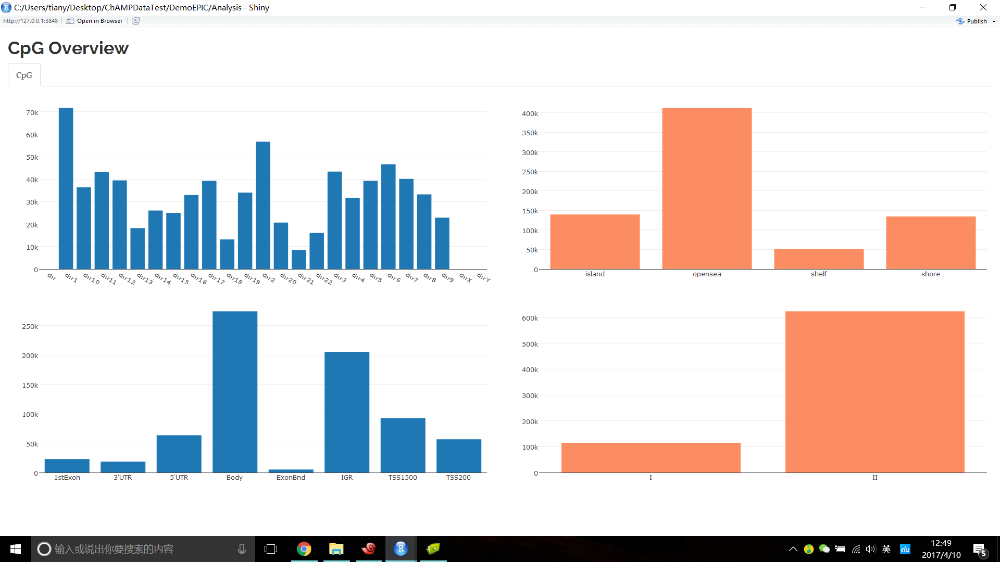
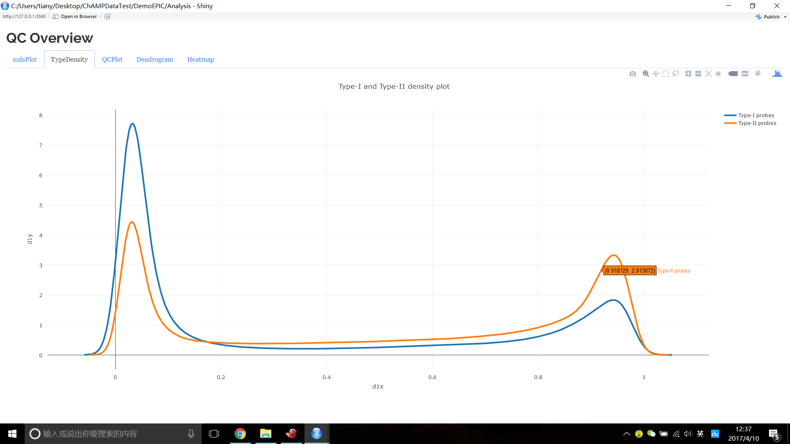
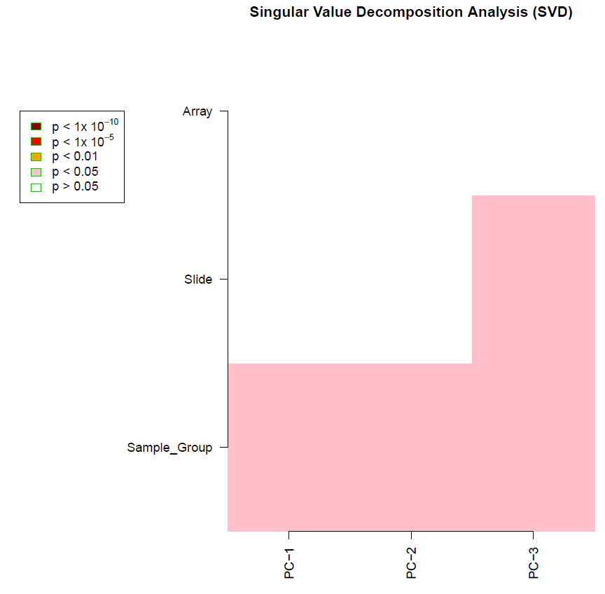
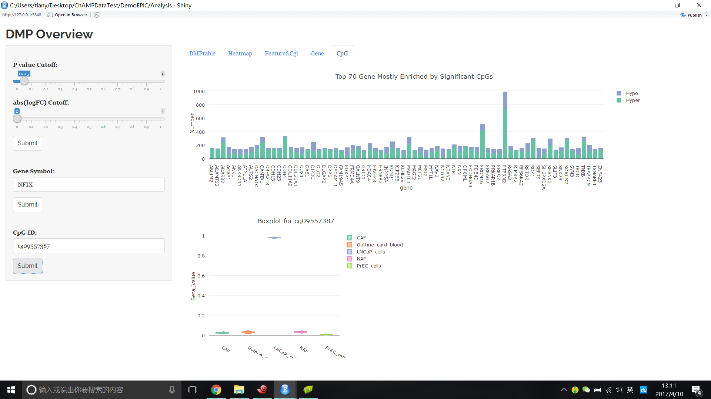
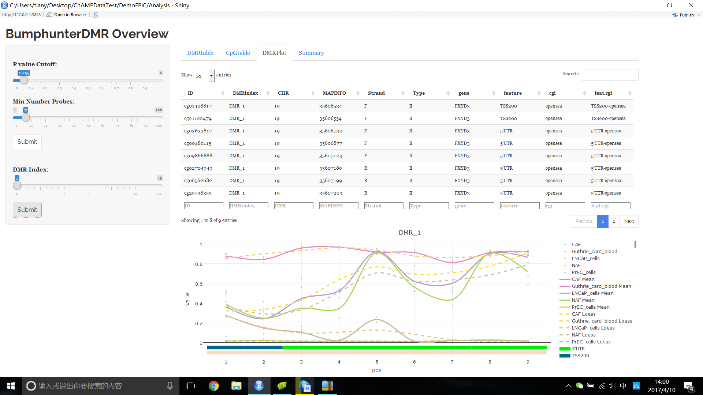
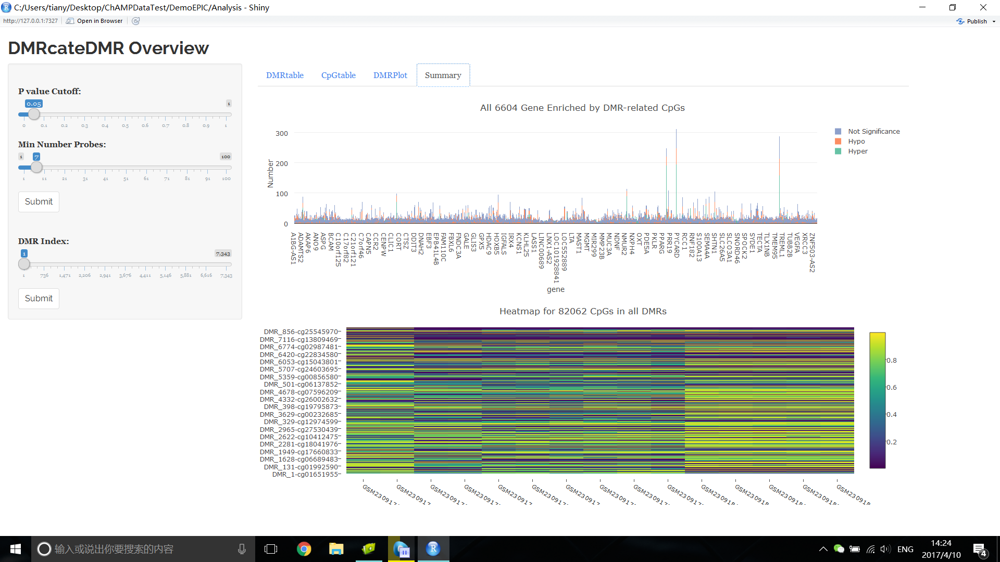
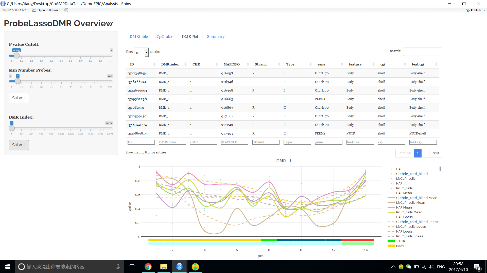
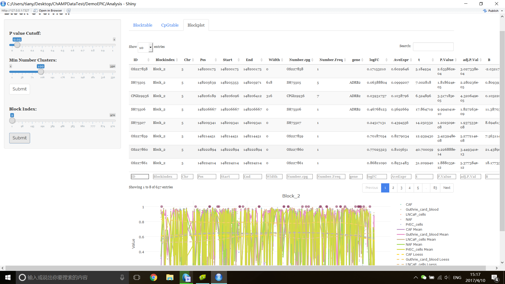
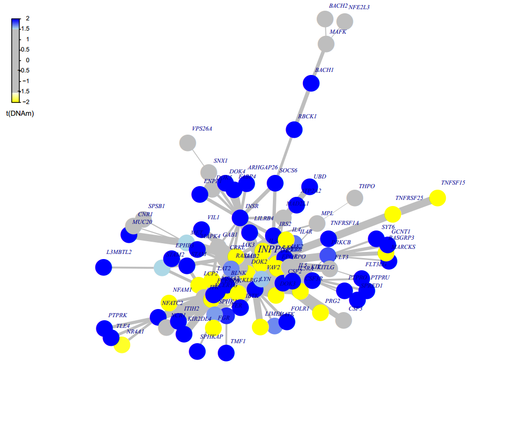
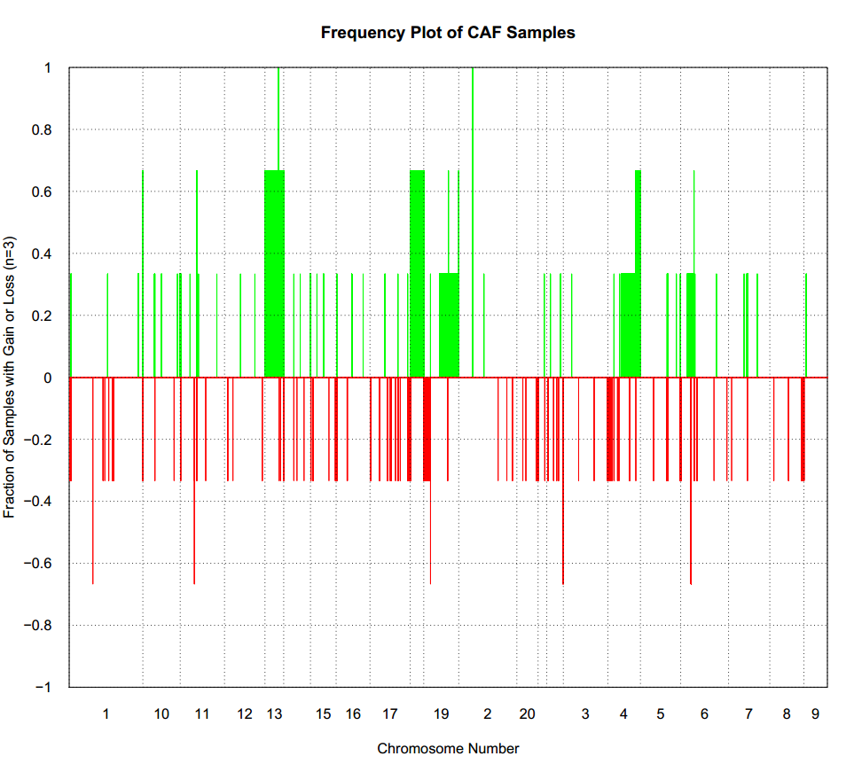

# DemoEPIC DataSet

This EPIC data set contains 15 samples, 3 CAF, 5 Guthrie_card_blood, 2 LNCaP_cells, 3 NAF, 2 PrEC_cells, which is used for testing EPIC dataset with ChAMP.

## Code：
``` r
myLoad <- champ.load(directory = "../Data",arraytype = "EPIC")
myLoad_2 <- champ.load("../Data/",method="minfi",arraytype="EPIC") # loaded as minfi way
CpG.GUI(arraytype="EPIC")
myNorm <- champ.norm(arraytype="EPIC")
myNorm_2 <- champ.norm(method="PBC",arraytype = "EPIC")
myNorm_3 <- champ.norm(beta=myLoad_2$beta,mset=myLoad_2$mset,rgSet=myLoad_2$rgSet,method="SWAN",arraytype="EPIC")
myNorm_4 <- champ.norm(beta=myLoad_2$beta,mset=myLoad_2$mset,rgSet=myLoad_2$rgSet,method="FunctionalNormalization",arraytype="EPIC")
QC.GUI(arraytype="EPIC")
myLoad$pd$Slide <- as.character(myLoad$pd$Slide)
champ.SVD(beta=myNorm)
myDMP <- champ.DMP(arraytype = "EPIC")
DMP.GUI()
myDMR <- champ.DMR(arraytype = "EPIC")
myDMR_2 <- champ.DMR(arraytype = "EPIC",method="DMRcate",cores=1)
myDMR_3 <- champ.DMR(arraytype = "EPIC",method="ProbeLasso",compare.group=c("PrEC_cells","LNCaP_cells"))
DMR.GUI(DMR=myDMR,arraytype="EPIC",compare.group=c("PrEC_cells","LNCaP_cells"))
DMR.GUI(DMR=myDMR_2,arraytype="EPIC",compare.group=c("PrEC_cells","LNCaP_cells"))
DMR.GUI(DMR=myDMR_3,arraytype="EPIC",compare.group=c("PrEC_cells","LNCaP_cells"))
myGSEA <- champ.GSEA(DMP=myDMP[[2]],arraytype = "EPIC")
myBlock <- champ.Block(arraytype = "EPIC")
Block.GUI(arraytype="EPIC",compare.group=c("PrEC_cells","LNCaP_cells"))
myEpiMod <- champ.EpiMod(arraytype="EPIC")
myrefbase <- champ.refbase(arraytype = "EPIC")
myCNA <- champ.CNA(control = F,arraytype = "EPIC")
```


### champ.load() result

Here we demonstrate new ChAMP way to load data, we did this because old mini loading relies on packages like mini, wateRmelon.e.g, recently since minfi get upgraded, there was a time that champ.load() function failed because of wateRmelon's beadcount function can not works on new minfi S4 object. So in case this situation happen again, we decided to code our own loading function.

``` r
> myLoad <- champ.load("../Data/",arraytype="EPIC")
[===========================]
[<<<< ChAMP.LOAD START >>>>>]
-----------------------------

[ Loading Data with ChAMP Method ]
----------------------------------
Note that ChAMP method will NOT return rgSet or mset, they object defined by minfi. Which means, if you use ChAMP method to load data, you can not use SWAN or FunctionNormliazation method in champ.norm() (you can use BMIQ or PBC still). But All other function should not be influenced.

[===========================]
[<<<< ChAMP.IMPORT START >>>>>]
-----------------------------

[ Section 1: Read PD Files Start ]
  CSV Directory: ../Data//Yuan_Tian_EPIC_PD_File.csv
  Find CSV Success
  Reading CSV File
  Replace Sentrix_Position into Array
  Replace Sentrix_ID into Slide
[ Section 1: Read PD file Done ]


[ Section 2: Read IDAT files Start ]
  Loading:../Data//GSM2309170_200134080018_R03C01_Grn.idat ---- (1/15)
  Loading:../Data//GSM2309171_200134080018_R04C01_Grn.idat ---- (2/15)
  Loading:../Data//GSM2309172_200134080018_R01C01_Grn.idat ---- (3/15)
  Loading:../Data//GSM2309173_200134080018_R02C01_Grn.idat ---- (4/15)
  Loading:../Data//GSM2309174_200134080009_R02C01_Grn.idat ---- (5/15)
  Loading:../Data//GSM2309175_200134080009_R03C01_Grn.idat ---- (6/15)
  Loading:../Data//GSM2309176_200134080009_R01C01_Grn.idat ---- (7/15)
  Loading:../Data//GSM2309177_200134080009_R05C01_Grn.idat ---- (8/15)
  Loading:../Data//GSM2309178_200134080009_R06C01_Grn.idat ---- (9/15)
  Loading:../Data//GSM2309179_200134080009_R04C01_Grn.idat ---- (10/15)
  Loading:../Data//GSM2309180_200134080009_R07C01_Grn.idat ---- (11/15)
  Loading:../Data//GSM2309181_200134080009_R08C01_Grn.idat ---- (12/15)
  Loading:../Data//GSM2309182_200134080015_R07C01_Grn.idat ---- (13/15)
  Loading:../Data//GSM2309183_200134080015_R08C01_Grn.idat ---- (14/15)
  Loading:../Data//GSM2309184_200134080019_R08C01_Grn.idat ---- (15/15)
  Loading:../Data//GSM2309170_200134080018_R03C01_Red.idat ---- (1/15)
  Loading:../Data//GSM2309171_200134080018_R04C01_Red.idat ---- (2/15)
  Loading:../Data//GSM2309172_200134080018_R01C01_Red.idat ---- (3/15)
  Loading:../Data//GSM2309173_200134080018_R02C01_Red.idat ---- (4/15)
  Loading:../Data//GSM2309174_200134080009_R02C01_Red.idat ---- (5/15)
  Loading:../Data//GSM2309175_200134080009_R03C01_Red.idat ---- (6/15)
  Loading:../Data//GSM2309176_200134080009_R01C01_Red.idat ---- (7/15)
  Loading:../Data//GSM2309177_200134080009_R05C01_Red.idat ---- (8/15)
  Loading:../Data//GSM2309178_200134080009_R06C01_Red.idat ---- (9/15)
  Loading:../Data//GSM2309179_200134080009_R04C01_Red.idat ---- (10/15)
  Loading:../Data//GSM2309180_200134080009_R07C01_Red.idat ---- (11/15)
  Loading:../Data//GSM2309181_200134080009_R08C01_Red.idat ---- (12/15)
  Loading:../Data//GSM2309182_200134080015_R07C01_Red.idat ---- (13/15)
  Loading:../Data//GSM2309183_200134080015_R08C01_Red.idat ---- (14/15)
  Loading:../Data//GSM2309184_200134080019_R08C01_Red.idat ---- (15/15)

  Extract Mean value for Green and Red Channel Success
    Your Red Green Channel contains 1052641 probes.
[ Section 2: Read IDAT Files Done ]


[ Section 3: Use Annotation Start ]

  Reading EPIC Annotation >>

  Fetching NEGATIVE ControlProbe.
    Totally, there are 411 control probes in Annotation.
    Your data set contains 411 control probes.

  Generating Meth and UnMeth Matrix
    Extracting Meth Matrix...
      Totally there are 865918 Meth probes in EPIC Annotation.
      Your data set contains 865918 Meth probes.
    Extracting UnMeth Matrix...
      Totally there are 865918 UnMeth probes in EPIC Annotation.
      Your data set contains 865918 UnMeth probes.

  Generating beta Matrix
  Generating M Matrix
  Generating intensity Matrix
  Calculating Detect P value
  Counting Beads
[ Section 3: Use Annotation Done ]

[<<<<< ChAMP.IMPORT END >>>>>>]
[===========================]
[You may want to process champ.filter() next.]

[===========================]
[<<<< ChAMP.FILTER START >>>>>]
-----------------------------

In New version ChAMP, champ.filter() function has been set to do filtering on the result of champ.import(). You can use champ.import() + champ.filter() to do Data Loading, or set "method" parameter in champ.load() as "ChAMP" to get the same effect.

This function is provided for user need to do filtering on some beta (or M) matrix, which contained most filtering system in champ.load except beadcount. User need to input beta matrix, pd file themselves. If you want to do filterintg on detP matrix and Bead Count, you also need to input a detected P matrix and Bead Count information.

Note that if you want to filter more data matrix, say beta, M, intensity... please make sure they have exactly the same rownames and colnames.


[ Section 1:  Check Input Start ]
  You have inputed beta,intensity for Analysis.

  pd file provided, checking if it's in accord with Data Matrix...
    pd file check success.

  Parameter filterDetP is TRUE, checking if detP in accord with Data Matrix...
    detP check success.

  Parameter filterBeads is TRUE, checking if beadcount in accord with Data Matrix...
    beadcount check success.

  parameter autoimpute is TRUE. Checking if the conditions are fulfilled...
    !!! ProbeCutoff is 0, which means you have no needs to do imputation. autoimpute has been reset FALSE.

  Checking Finished :filterDetP,filterBeads,filterMultiHit,filterSNPs,filterNoCG,filterXY would be done on beta,intensity.
  You also provided :detP,beadcount .
[ Section 1: Check Input Done ]


[ Section 2: Filtering Start >>

  Filtering Detect P value Start
    The fraction of failed positions per sample
    You may need to delete samples with high proportion of failed probes:

           Failed CpG Fraction.
GSM2309170         0.0006755836
GSM2309171         0.0006767384
GSM2309172         0.0005543250
GSM2309173         0.0005219894
GSM2309174         0.0006848224
GSM2309175         0.0095020545
GSM2309176         0.0009053975
GSM2309177         0.0010047141
GSM2309178         0.0009619849
GSM2309179         0.0009804624
GSM2309180         0.0011825600
GSM2309181         0.0012056569
GSM2309182         0.0007160031
GSM2309183         0.0007102289
GSM2309184         0.0009793075

    Filtering probes with a detection p-value above 0.01.
    Removing 10884 probes.
    If a large number of probes have been removed, ChAMP suggests you to identify potentially bad samples

  Filtering BeadCount Start
    Filtering probes with a beadcount <3 in at least 5% of samples.
    Removing 19962 probes

  Filtering NoCG Start
    Only Keep CpGs, removing 2889 probes from the analysis.

  Filtering SNPs Start
    Using general EPIC SNP list for filtering.
    Filtering probes with SNPs as identified in Zhou's Nucleic Acids Research Paper 2016.
    Removing 77586 probes from the analysis.

  Filtering MultiHit Start
    Filtering probes that align to multiple locations as identified in Nordlund et al
    Removing 47 probes from the analysis.

  Filtering XY Start
    Filtering probes located on X,Y chromosome, removing 16600 probes from the analysis.

  Updating PD file

  Fixing Outliers Start
    Replacing all value smaller/equal to 0 with smallest positive value.
    Replacing all value greater/equal to 1 with largest value below 1..
[ Section 2: Filtering Done ]

 All filterings are Done, now you have 737950 probes and 15 samples.

[<<<<< ChAMP.FILTER END >>>>>>]
[===========================]
[You may want to process champ.QC() next.]

[<<<<< ChAMP.LOAD END >>>>>>]
[===========================]
[You may want to process champ.QC() next.]

>
```

### champ.load() minfi way

Here we demonstrate old minfi way to load data, which is just like very old version of ChAMP. The returned result contains rgSet and mset, which is needed by SWAN normalization, Functional Normalization and RGEffect parameter in champ.SVD(). Except these three functions, all other functions works both one result from two loading ways.

``` r
> myLoad_2 <- champ.load("../Data/",method="minfi",arraytype="EPIC")
[===========================]
[<<<< ChAMP.LOAD START >>>>>]
-----------------------------

[ Loading Data with Minfi Method ]
----------------------------------
Loading data from ../Data/
[read.metharray.sheet] Found the following CSV files:
[1] "../Data//Yuan_Tian_EPIC_PD_File.csv"
<< Read DataSet Success. >>

The fraction of failed positions per sample

            (You may need to delete samples with high proportion of failed probes
):
           Failed CpG Fraction.
GSM2309170         0.0007521607
GSM2309171         0.0007452390
GSM2309172         0.0006379523
GSM2309173         0.0005964219
GSM2309174         0.0007660042
GSM2309175         0.0097400200
GSM2309176         0.0010036501
GSM2309177         0.0010982470
GSM2309178         0.0010636383
GSM2309179         0.0010763282
GSM2309180         0.0012828263
GSM2309181         0.0013208958
GSM2309182         0.0008075345
GSM2309183         0.0008063809
GSM2309184         0.0010659456
Filtering probes with a detection p-value above 0.01 in one or more samples has removed 11176 probes from the analysis. If a large number of probes have been removed, ChAMP suggests you to identify potentially bad samples.
<< Filter DetP Done. >>


There is no NA values in your matrix, there is no need to imputation.

Filtering probes with a beadcount <3 in at least 5% of samples, has removed 19994 from the analysis.
<< Filter Beads Done. >>

Filtering non-cg probes, has removed 2831 from the analysis.
<< Filter NoCG Done. >>

Using general EPIC SNP list for filtering.
Filtering probes with SNPs as identified in Zhou's Nucleic Acids Research Paper, 2016, has removed 77704 from the analysis.
<< Filter SNP Done. >>

Filtering probes that align to multiple locations as identified in Nordlund et al, has removed 47 from the analysis.
<< Filter MultiHit Done. >>

Filtering probes on the X or Y chromosome has removed 17134 from the analysis.
<< Filter XY chromosome Done. >>

[Beta value is selected as output.]

Zeros in your dataset have been replaced with smallest positive value.

One in your dataset have been replaced with largest value below 1.

The analysis will be proceed with 737950 probes and 15 samples.

Current Data Set contains 0 NA in [Beta] Matrix.

[<<<<< ChAMP.LOAD END >>>>>>]
[===========================]
[You may want to process champ.QC() next.]

>
```

### CpG.GUI() Result
``` r
QC.GUI(beta=myNorm,arraytype="EPIC")
```




### champ.norm() Result

Here we demonstrate the Normalization method of BMIQ.

``` r
> myNorm <- champ.norm(arraytype="EPIC")
[===========================]
[>>>>> ChAMP.NORM START <<<<<<]
-----------------------------
champ.norm Results will be saved in ./CHAMP_Normalization/
[ SWAN method call for BOTH rgSet and mset input, FunctionalNormalization call for rgset only , while PBC and BMIQ only needs beta value. Please set parameter correctly. ]

<< Normalizing data with BMIQ Method >>
Note that,BMIQ function may fail for bad quality samples (Samples did not even show beta distribution).
3 cores will be used to do parallel BMIQ computing.
[>>>>> ChAMP.NORM END <<<<<<]
[===========================]
[You may want to process champ.SVD() next.]

>
```
Here we demonstrate the Normalization method of PBC.
``` r
> myNorm_2 <- champ.norm(method="PBC",arraytype = "EPIC")
[===========================]
[>>>>> ChAMP.NORM START <<<<<<]
-----------------------------
champ.norm Results will be saved in ./CHAMP_Normalization/
[ SWAN method call for BOTH rgSet and mset input, FunctionNormalization call for rgset only , while PBC and BMIQ only needs beta value. Please set parameter correctly. ]

<< Normalizing data with PBC Method >>
[1] "Done for sample 1"
[1] "Done for sample 2"
[1] "Done for sample 3"
[1] "Done for sample 4"
[1] "Done for sample 5"
[1] "Done for sample 6"
[1] "Done for sample 7"
[1] "Done for sample 8"
[1] "Done for sample 9"
[1] "Done for sample 10"
[1] "Done for sample 11"
[1] "Done for sample 12"
[1] "Done for sample 13"
[1] "Done for sample 14"
[1] "Done for sample 15"
[>>>>> ChAMP.NORM END <<<<<<]
[===========================]
[You may want to process champ.SVD() next.]

Warning message:
In dir.create(resultsDir) : '.\CHAMP_Normalization' already exists
```

Here we demonstrate the Normalization method of SWAN.

``` r
> myNorm_3 <- champ.norm(beta=myLoad_2$beta,mset=myLoad_2$mset,rgSet=myLoad_2$rgSet,method="SWAN",arraytype="EPIC")
[===========================]
[>>>>> ChAMP.NORM START <<<<<<]
-----------------------------
champ.norm Results will be saved in ./CHAMP_Normalization/
[ SWAN method call for BOTH rgSet and mset input, FunctionalNormalization call for rgset only , while PBC and BMIQ only needs beta value. Please set parameter correctly. ]

[>>>>> ChAMP.NORM END <<<<<<]
[===========================]
[You may want to process champ.SVD() next.]

>
```

Here we demonstrate the Normalization method of FunctionalNormalization.

``` r
> myNorm_4 <- champ.norm(beta=myLoad_2$beta,mset=myLoad_2$mset,rgSet=myLoad_2$rgSet,method="FunctionalNormalization",arraytype="EPIC")
[===========================]
[>>>>> ChAMP.NORM START <<<<<<]
-----------------------------
champ.norm Results will be saved in ./CHAMP_Normalization/
[ SWAN method call for BOTH rgSet and mset input, FunctionalNormalization call for rgset only , while PBC and BMIQ only needs beta value. Please set parameter correctly. ]

[preprocessFunnorm] Background and dye bias correction with noob
Loading required package: IlluminaHumanMethylationEPICanno.ilm10b2.hg19
[preprocessNoob] Applying R/G ratio flip to fix dye bias...
[preprocessFunnorm] Mapping to genome
[preprocessFunnorm] Quantile extraction
[preprocessFunnorm] Normalization
[>>>>> ChAMP.NORM END <<<<<<]
[===========================]
[You may want to process champ.SVD() next.]

>
```


### QC.GUI() Result


### champ.SVD() Result

We noticed that Slide is pd file is numeric, which is not correct, so we firstly manually change it into charater.

``` r
> myLoad$pd$Slide <- as.character(myLoad$pd$Slide)
> champ.SVD(beta=myNorm)
[===========================]
[<<<<< ChAMP.SVD START >>>>>]
-----------------------------
champ.SVD Results will be saved in ./CHAMP_SVDimages/ .

[SVD analysis will be proceed with 737950 probes and 15 samples.]


[ champ.SVD() will only check the dimensions between data and pd, instead if checking if Sample_Names are correctly matched (because some user may have no Sample_Names in their pd file),thus please make sure your pd file is in accord with your data sets (beta) and (rgSet).]

<< Following Factors in your pd(sample_sheet.csv) will be analysised: >>
<Sample_Group>(character):LNCaP_cells, PrEC_cells, CAF, NAF, Guthrie_card_blood
<Slide>(character):200134080018, 200134080009, 200134080015, 200134080019
<Array>(factor):R03C01, R04C01, R01C01, R02C01, R05C01, R06C01, R07C01, R08C01
[champ.SVD have automatically select ALL factors contain at least two different values from your pd(sample_sheet.csv), if you don't want to analysis some of them, please remove them manually from your pd variable then retry champ.SVD().]

<< Following Factors in your pd(sample_sheet.csv) will not be analysis: >>
<Sample_Name>
<Sample_Plate>
<Pool_ID>
<Project>
<Sample_Well>
[Factors are ignored because they only indicate Name or Project, or they contain ONLY ONE value across all Samples.]

<< PhenoTypes.lv generated successfully. >>
<< Calculate SVD matrix successfully. >>
<< Plot SVD matrix successfully. >>
[<<<<<< ChAMP.SVD END >>>>>>]
[===========================]
[If the batch effect is not significant, you may want to process champ.DMP() or champ.DMR() or champ.BlockFinder() next, otherwise, you may want to run champ.runCombat() to eliminat batch effect, then rerun champ.SVD() to check corrected result.]

>
```



### champ.runCombat Result
This data set can not be performed batch correction, because "Slide" factor in pd file contains phenotypes below:
``` r
> table(myLoad$pd$Slide)

200134080009 200134080015 200134080018 200134080019
           8            2            4            1
>
```
Phenotype 200134080019 contains only one variable, not able to be corrected by Combat algorithm. However, even if we remove phenotype 200134080019 related samples, it's still not working, because Combat function, defined by SVA package and paper, requirs that there MUST NOT have any confounding effect between covariates about to be analysied and batches to be corrected. So to say aftering modeling covariate "Sample_Group" and batch "Slide", the modeled matrix MUST be a Full Rank Matrix.

Now let's make a test below:
``` r
> table(myLoad$pd$Sample_Group,myLoad$pd$Slide)

                     200134080009 200134080015 200134080018 200134080019
  CAF                           3            0            0            0
  Guthrie_card_blood            2            2            0            1
  LNCaP_cells                   0            0            2            0
  NAF                           3            0            0            0
  PrEC_cells                    0            0            2            0
>
```
Now we can see that in above matrix, column 200134090015 actually can be represented by 200134080019 column. Also, we can see all PrEC_cells samples are 200134080018 column. So to say, "Sample_Group" and "Slide" here are strongly confounded with each other. It's not our program's probem that champ.runCombat() is not working, but actually the data's status is not fulfilled.

### champ.DMP() Result

Then we calculate DMP, since there are multiple groups of phenotypes in pheno parameter, champ.DMP() would compare each pair of them.

``` r
> myDMP <- champ.DMP(arraytype = "EPIC")
[===========================]
[<<<<< ChAMP.DMP START >>>>>]
-----------------------------
!!! Important !!! New Modification has been made on champ.DMP():

    (1): In this version champ.DMP() if your pheno parameter contains more than two groups of phenotypes, champ.DMP() would do pairewise differential methylated analysis between each pair of them. But you can also specify compare.group to only do comparasion between any two of them.

    (2): champ.DMP() now support numeric as pheno, and will do linear regression on them. So covariates like age could be inputted in this function. You need to make sure your inputted "pheno" parameter is "numeric" type.

--------------------------------

[ Section 1:  Check Input Pheno Start ]

  You pheno is character type.
    Your pheno information contains following groups. >>
    <LNCaP_cells>:2 samples.
    <PrEC_cells>:2 samples.
    <CAF>:3 samples.
    <NAF>:3 samples.
    <Guthrie_card_blood>:5 samples.
    [The power of statistics analysis on groups contain very few samples may not strong.]
    pheno contains 5 phenotypes
    compare.group parameter is NULL, EACH PAIR of phenotypes will be added into Compare List.
    LNCaP_cells_to_PrEC_cells compare group : LNCaP_cells, PrEC_cells
    LNCaP_cells_to_CAF compare group : LNCaP_cells, CAF
    LNCaP_cells_to_NAF compare group : LNCaP_cells, NAF
    LNCaP_cells_to_Guthrie_card_blood compare group : LNCaP_cells, Guthrie_card_blood
    PrEC_cells_to_CAF compare group : PrEC_cells, CAF
    PrEC_cells_to_NAF compare group : PrEC_cells, NAF
    PrEC_cells_to_Guthrie_card_blood compare group : PrEC_cells, Guthrie_card_blood
    CAF_to_NAF compare group : CAF, NAF
    CAF_to_Guthrie_card_blood compare group : CAF, Guthrie_card_blood
    NAF_to_Guthrie_card_blood compare group : NAF, Guthrie_card_blood

[ Section 1:  Check Input Pheno Done ]


[ Section 2:  Find Differential Methylated CpGs Start ]

  -----------------------------
  Start to Compare : LNCaP_cells, PrEC_cells
  Contrast Matrix
              Contrasts
Levels         pPrEC_cells-pLNCaP_cells
  pLNCaP_cells                       -1
  pPrEC_cells                         1
  You have found 457925 significant MVPs with a BH adjusted P-value below 0.05.
  Calculate DMP for LNCaP_cells and PrEC_cells done.
  -----------------------------
  Start to Compare : LNCaP_cells, CAF
  Contrast Matrix
              Contrasts
Levels         pLNCaP_cells-pCAF
  pCAF                        -1
  pLNCaP_cells                 1
  You have found 297681 significant MVPs with a BH adjusted P-value below 0.05.
  Calculate DMP for LNCaP_cells and CAF done.
  -----------------------------
  Start to Compare : LNCaP_cells, NAF
  Contrast Matrix
              Contrasts
Levels         pNAF-pLNCaP_cells
  pLNCaP_cells                -1
  pNAF                         1
  You have found 300762 significant MVPs with a BH adjusted P-value below 0.05.
  Calculate DMP for LNCaP_cells and NAF done.
  -----------------------------
  Start to Compare : LNCaP_cells, Guthrie_card_blood
  Contrast Matrix
                     Contrasts
Levels                pLNCaP_cells-pGuthrie_card_blood
  pGuthrie_card_blood                               -1
  pLNCaP_cells                                       1
  You have found 478850 significant MVPs with a BH adjusted P-value below 0.05.
  Calculate DMP for LNCaP_cells and Guthrie_card_blood done.
  -----------------------------
  Start to Compare : PrEC_cells, CAF
  Contrast Matrix
             Contrasts
Levels        pPrEC_cells-pCAF
  pCAF                      -1
  pPrEC_cells                1
  You have found 146846 significant MVPs with a BH adjusted P-value below 0.05.
  Calculate DMP for PrEC_cells and CAF done.
  -----------------------------
  Start to Compare : PrEC_cells, NAF
  Contrast Matrix
             Contrasts
Levels        pPrEC_cells-pNAF
  pNAF                      -1
  pPrEC_cells                1
  You have found 158814 significant MVPs with a BH adjusted P-value below 0.05.
  Calculate DMP for PrEC_cells and NAF done.
  -----------------------------
  Start to Compare : PrEC_cells, Guthrie_card_blood
  Contrast Matrix
                     Contrasts
Levels                pPrEC_cells-pGuthrie_card_blood
  pGuthrie_card_blood                              -1
  pPrEC_cells                                       1
  You have found 380284 significant MVPs with a BH adjusted P-value below 0.05.
  Calculate DMP for PrEC_cells and Guthrie_card_blood done.
  -----------------------------
  Start to Compare : CAF, NAF
  Contrast Matrix
      Contrasts
Levels pNAF-pCAF
  pCAF        -1
  pNAF         1
  You have found 252 significant MVPs with a BH adjusted P-value below 0.05.
  Calculate DMP for CAF and NAF done.
  -----------------------------
  Start to Compare : CAF, Guthrie_card_blood
  Contrast Matrix
                     Contrasts
Levels                pGuthrie_card_blood-pCAF
  pCAF                                      -1
  pGuthrie_card_blood                        1
  You have found 356833 significant MVPs with a BH adjusted P-value below 0.05.
  Calculate DMP for CAF and Guthrie_card_blood done.
  -----------------------------
  Start to Compare : NAF, Guthrie_card_blood
  Contrast Matrix
                     Contrasts
Levels                pNAF-pGuthrie_card_blood
  pGuthrie_card_blood                       -1
  pNAF                                       1
  You have found 351460 significant MVPs with a BH adjusted P-value below 0.05.
  Calculate DMP for NAF and Guthrie_card_blood done.

[ Section 2:  Find Numeric Vector Related CpGs Done ]


[ Section 3:  Match Annotation Start ]


[ Section 3:  Match Annotation Done ]

[<<<<<< ChAMP.DMP END >>>>>>]
[===========================]
[You may want to process DMP.GUI() or champ.GSEA() next.]

>
```


### DMP.GUI() Result

Here we use DMP.GUI() to check the first DMP result from above function.

``` r
DMP.GUI()
```



### champ.DMR() Result

Here we use three different ways to calculate DMR.

``` r
> myDMR <- champ.DMR(arraytype = "EPIC")
[===========================]
[<<<<< ChAMP.DMR START >>>>>]
-----------------------------
!!! important !!! We just upgrate champ.DMR() function, since now champ.DMP() could works on multiple phenotypes, but ProbeLasso can only works on one DMP result, so if your pheno parameter contains more than 2 phenotypes, and you want to use ProbeLasso function, you MUST specify compare.group=c("A","B"). Bumphunter and DMRcate should not be influenced.

[ Section 1:  Check Input Pheno Start ]

  You pheno is character type.
    Your pheno information contains following groups. >>
    <LNCaP_cells>:2 samples.
    <PrEC_cells>:2 samples.
    <CAF>:3 samples.
    <NAF>:3 samples.
    <Guthrie_card_blood>:5 samples.

[ Section 1:  Check Input Pheno Done ]


[ Section 2:  Run DMR Algorithm Start ]

<< Find DMR with Bumphunter Method >>
3 cores will be used to do parallel Bumphunter computing.
According to your data set, champ.DMR() detected 10948 clusters contains MORE THAN 7 probes within300 maxGap. These clusters will be used to find DMR.

[bumphunterEngine] Parallelizing using 3 workers/cores (backend: doParallelMC, version: 1.0.10).
[bumphunterEngine] Computing coefficients.
[bumphunterEngine] Smoothing coefficients.
Loading required package: rngtools
Loading required package: pkgmaker
Loading required package: registry

Attaching package: 'pkgmaker'

The following object is masked from 'package:S4Vectors':

    new2

The following object is masked from 'package:base':

    isNamespaceLoaded

[bumphunterEngine] Performing 250 bootstraps.
[bumphunterEngine] Computing marginal bootstrap p-values.
[bumphunterEngine] Smoothing bootstrap coefficients.
[bumphunterEngine] cutoff: 0.823
[bumphunterEngine] Finding regions.
[bumphunterEngine] Found 418 bumps.
[bumphunterEngine] Computing regions for each bootstrap.
[bumphunterEngine] Estimating p-values and FWER.
<< Calculate DMR success. >>
Bumphunter detected 17 DMRs with P value <= 0.05.

[ Section 2:  Run DMR Algorithm Done ]

[<<<<<< ChAMP.DMR END >>>>>>]
[===========================]
[You may want to process DMR.GUI() or champ.GSEA() next.]

>
```

Here we run it with DMRcate method.

``` r
> myDMR_2 <- champ.DMR(arraytype = "EPIC",method="DMRcate",cores=1)
[===========================]
[<<<<< ChAMP.DMR START >>>>>]
-----------------------------
!!! important !!! We just upgrate champ.DMR() function, since now champ.DMP() could works on multiple phenotypes, but ProbeLasso can only works on one DMP result, so if your pheno parameter contains more than 2 phenotypes, and you want to use ProbeLasso function, you MUST specify compare.group=c("A","B"). Bumphunter and DMRcate should not be influenced.

[ Section 1:  Check Input Pheno Start ]

  You pheno is character type.
    Your pheno information contains following groups. >>
    <LNCaP_cells>:2 samples.
    <PrEC_cells>:2 samples.
    <CAF>:3 samples.
    <NAF>:3 samples.
    <Guthrie_card_blood>:5 samples.

[ Section 1:  Check Input Pheno Done ]


[ Section 2:  Run DMR Algorithm Start ]

1 cores will be used to do parallel DMRcate computing.
<< Find DMR with DMRcate Method >>
Your contrast returned 235525 individually significant probes. We recommend the default setting of pcutoff in dmrcate().
Fitting chr1...
Fitting chr10...
Fitting chr11...
Fitting chr12...
Fitting chr13...
Fitting chr14...
Fitting chr15...
Fitting chr16...
Fitting chr17...
Fitting chr18...
Fitting chr19...
Fitting chr2...
Fitting chr20...
Fitting chr21...
Fitting chr22...
Fitting chr3...
Fitting chr4...
Fitting chr5...
Fitting chr6...
Fitting chr7...
Fitting chr8...
Fitting chr9...
Demarcating regions...
Done!
DMRcate detected 7362 DMRs with mafcut as= 0.05.

[ Section 2:  Run DMR Algorithm Done ]

[<<<<<< ChAMP.DMR END >>>>>>]
[===========================]
[You may want to process DMR.GUI() or champ.GSEA() next.]

Warning messages:
1: In if (arraytype == "450K") { :
  the condition has length > 1 and only the first element will be used
2: In if (arraytype == "EPIC") { :
  the condition has length > 1 and only the first element will be used
>
```

Here we run it with ProbeLasso method. Since this data set contains multiple phenotypes, you must specify compare.group parameter when your do it.

``` r
> myDMR_3 <- champ.DMR(arraytype = "EPIC",method="ProbeLasso",compare.group=c("PrEC_cells","LNCaP_cells"))
[===========================]
[<<<<< ChAMP.DMR START >>>>>]
-----------------------------
!!! important !!! We just upgrate champ.DMR() function, since now champ.DMP() could works on multiple phenotypes, but ProbeLasso can only works on one DMP result, so if your pheno parameter contains more than 2 phenotypes, and you want to use ProbeLasso function, you MUST specify compare.group=c("A","B"). Bumphunter and DMRcate should not be influenced.

[ Section 1:  Check Input Pheno Start ]

  You pheno is character type.
    Your pheno information contains following groups. >>
    <LNCaP_cells>:2 samples.
    <PrEC_cells>:2 samples.
    <CAF>:3 samples.
    <NAF>:3 samples.
    <Guthrie_card_blood>:5 samples.
  ProbeLasso Method can only be done between two phenotypes. So we need to do more check here...
    Your pheno contains more than two phenotypes.
    You may specify compare.group to do comparision between certain two phenotypes
    Your compare.group is in accord with your pheno parameter, which is good.
    Now champ.DMR() would extract values for only these two phenotypes to analysis.

[ Section 1:  Check Input Pheno Done ]


[ Section 2:  Run DMR Algorithm Start ]

champ.DMR Results will be saved in ./CHAMP_ProbeLasso/
<< Find DMR with ProbeLasso Method >>
[===========================]
[<<<<< ChAMP.DMP START >>>>>]
-----------------------------
!!! Important !!! New Modification has been made on champ.DMP():

    (1): In this version champ.DMP() if your pheno parameter contains more than two groups of phenotypes, champ.DMP() would do pairewise differential methylated analysis between each pair of them. But you can also specify compare.group to only do comparasion between any two of them.

    (2): champ.DMP() now support numeric as pheno, and will do linear regression on them. So covariates like age could be inputted in this function. You need to make sure your inputted "pheno" parameter is "numeric" type.

--------------------------------

[ Section 1:  Check Input Pheno Start ]

  You pheno is character type.
    Your pheno information contains following groups. >>
    <LNCaP_cells>:2 samples.
    <PrEC_cells>:2 samples.
    [The power of statistics analysis on groups contain very few samples may not strong.]
    pheno contains only 2 phenotypes
    compare.group parameter is NULL, two pheno types will be added into Compare List.
    LNCaP_cells_to_PrEC_cells compare group : LNCaP_cells, PrEC_cells

[ Section 1:  Check Input Pheno Done ]


[ Section 2:  Find Differential Methylated CpGs Start ]

  -----------------------------
  Start to Compare : LNCaP_cells, PrEC_cells
  Contrast Matrix
              Contrasts
Levels         pPrEC_cells-pLNCaP_cells
  pLNCaP_cells                       -1
  pPrEC_cells                         1
  You have found 737950 significant MVPs with a BH adjusted P-value below 1.
  Calculate DMP for LNCaP_cells and PrEC_cells done.

[ Section 2:  Find Numeric Vector Related CpGs Done ]


[ Section 3:  Match Annotation Start ]


[ Section 3:  Match Annotation Done ]

[<<<<<< ChAMP.DMP END >>>>>>]
[===========================]
[You may want to process DMP.GUI() or champ.GSEA() next.]

<< Get closestProbe for each Probe >>
<< Get lassoQuantileThreshold for each featureCgi >>
<< Get expend ranges for each probe >>
<< Get DMR from overlapped probes >>
<< Get adjusted P value for DMR >>
<< Get Start-End Ranges for each DMR >>
<< Calculate Methylation Scores for each DMR >>
<< Generate Probe-level Data >>
<< Generate DMR metadata >>
ProbeLasso detected 527 DMRs with P value <= 0.05.

[ Section 2:  Run DMR Algorithm Done ]

[<<<<<< ChAMP.DMR END >>>>>>]
[===========================]
[You may want to process DMR.GUI() or champ.GSEA() next.]

There were 28 warnings (use warnings() to see them)
>
```


### DMR.GUI() Result
``` r
DMR.GUI(DMR=myDMR,arraytype="EPIC",compare.group=c("PrEC_cells","LNCaP_cells"))
```

``` r
DMR.GUI(DMR=myDMR_2,arraytype="EPIC",compare.group=c("PrEC_cells","LNCaP_cells"))
```

``` r
DMR.GUI(DMR=myDMR_3,arraytype="EPIC",compare.group=c("PrEC_cells","LNCaP_cells"))
```



### champ.GSEA() Result
``` r
> myGSEA <- champ.GSEA(DMP=myDMP[[2]],arraytype = "EPIC")
[===========================]
[<<<< ChAMP.GSEA START >>>>>]
-----------------------------
<< Prepare CpG List Ready  >>
  Calculating GSEA with gometh method on DMP CpG list
  Note that gometh method would count numbers of CpGs in each genes and correct this bias.
  Calculating GSEA with gometh method on DMR CpG list
  Note that gometh method would count numbers of CpGs in each genes and correct this bias.
[<<<<< ChAMP.GSEA END >>>>>>]
[===========================]
Warning messages:
1: In alias2SymbolTable(flat$symbol) :
  Multiple symbols ignored for one or more aliases
2: In alias2SymbolTable(flat$symbol) :
  Multiple symbols ignored for one or more aliases
>
```

### champ.Block() Result
``` r
> myBlock <- champ.Block(arraytype = "EPIC")
[===========================]
[<<<< ChAMP.Block START >>>>]
-----------------------------
<< Load Annotation Successfully >>
<< Get Clusters by cgi-info Successfully >>
<< Calculate Average Beta Value Successfully >>
<< Generate Block Position Successfully >>
<< New Clusters are generated for blocks >>
<< Generate information for New Clusters >>
[bumphunterEngine] Parallelizing using 3 workers/cores (backend: doParallelMC, version: 1.0.10).
[bumphunterEngine] Computing coefficients.
[bumphunterEngine] Smoothing coefficients.
[bumphunterEngine] Performing 500 permutations.
[bumphunterEngine] Computing marginal permutation p-values.
[bumphunterEngine] Smoothing permutation coefficients.
[bumphunterEngine] cutoff: 0.019
[bumphunterEngine] Finding regions.
[bumphunterEngine] Found 891 bumps.
[bumphunterEngine] Computing regions for each permutation.
[bumphunterEngine] Estimating p-values and FWER.
<< Run Bumphunter Successfully >>
[<<<<< ChAMP.BLOCK END >>>>>]
[===========================]
[You may want to process Block.GUI() next.]

>
```
### Block.GUI() Result
``` r
Block.GUI(arraytype="EPIC",compare.group=c("PrEC_cells","LNCaP_cells"))
```



### champ.EpiMod() Result


### champ.refase() Result
Actulaly this EPIC data is not suitable to do Reference-Based Correction, So here we just run it to show ChAMP support EPIC data on champ.refbase() fully.
``` r
> myrefbase <- champ.refbase(arraytype = "EPIC")
[===========================]
[<<< ChAMP.REFBASE START >>>]
-----------------------------
<< Load projectWBC function success. >>
Mean value for each estimated Cell Proportion:
      CD8T       CD4T         NK      Bcell       Mono       Gran
0.02501728 0.26413407 0.04107754 0.18444753 0.22614489 0.25917869
CD8T has smallest cell proportion, all other cell proportions will be corrected by linear regression method.
All cell proportion influence except the one with least cell proportion get corrected.

[<<<< ChAMP.REFBASE END >>>>]
[===========================]
>
```

### champ.CNA() Result
``` r
> myCNA <- champ.CNA(control = F,arraytype = "EPIC")
[===========================]
[<<<<< ChAMP.CNA START >>>>>]
-----------------------------
champ.CNA Results will be saved in ./CHAMP_CNA .

ChaMP.CNA does not provide batch Correct on intensity data now, but you can use champ.runCombat to correct slides batch yourself.
<< Calculate mean value difference between each sample to mean all samples >>
<< Generate CHR and MAPINFO information >>
<< Processing Samples >>
Analyzing: GSM2309170.qn
Analyzing: GSM2309171.qn
Analyzing: GSM2309172.qn
Analyzing: GSM2309173.qn
Analyzing: GSM2309174.qn
Analyzing: GSM2309175.qn
Analyzing: GSM2309176.qn
Analyzing: GSM2309177.qn
Analyzing: GSM2309178.qn
Analyzing: GSM2309179.qn
Analyzing: GSM2309180.qn
Analyzing: GSM2309181.qn
Analyzing: GSM2309182.qn
Analyzing: GSM2309183.qn
Analyzing: GSM2309184.qn
<< Processing Groups >>
Analyzing: GSM2309170.LNCaP_cells.qn
Analyzing: GSM2309171.LNCaP_cells.qn
Analyzing: GSM2309172.PrEC_cells.qn
Analyzing: GSM2309173.PrEC_cells.qn
Analyzing: GSM2309174.CAF.qn
Analyzing: GSM2309175.CAF.qn
Analyzing: GSM2309176.CAF.qn
Analyzing: GSM2309177.NAF.qn
Analyzing: GSM2309178.NAF.qn
Analyzing: GSM2309179.NAF.qn
Analyzing: GSM2309180.Guthrie_card_blood.qn
Analyzing: GSM2309181.Guthrie_card_blood.qn
Analyzing: GSM2309182.Guthrie_card_blood.qn
Analyzing: GSM2309183.Guthrie_card_blood.qn
Analyzing: GSM2309184.Guthrie_card_blood.qn
[<<<<<< ChAMP.CNA END >>>>>>]
[===========================]
```

